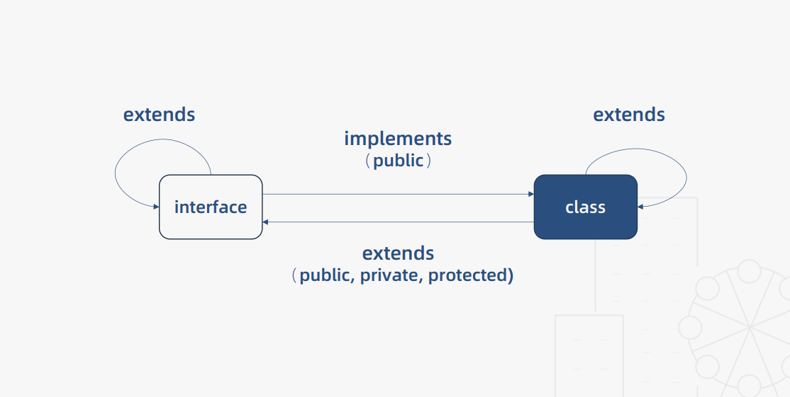

# 类与接口

## 编写示例
1-基础篇\1.4-code-demo\src\part1.base\12.class-interface.ts

## 类与接口的关系

> 接口与接口之间是可以相互继承的，可以实现接口的复用
> 类与类之间是可以相互继承的，可以实现方法和属性的复用
> 接口可以通过类来实现，但接口只能约束类的公有成员
> 接口可以抽离出类的成员，抽离后会包含类的公有、受保护、私有成员

