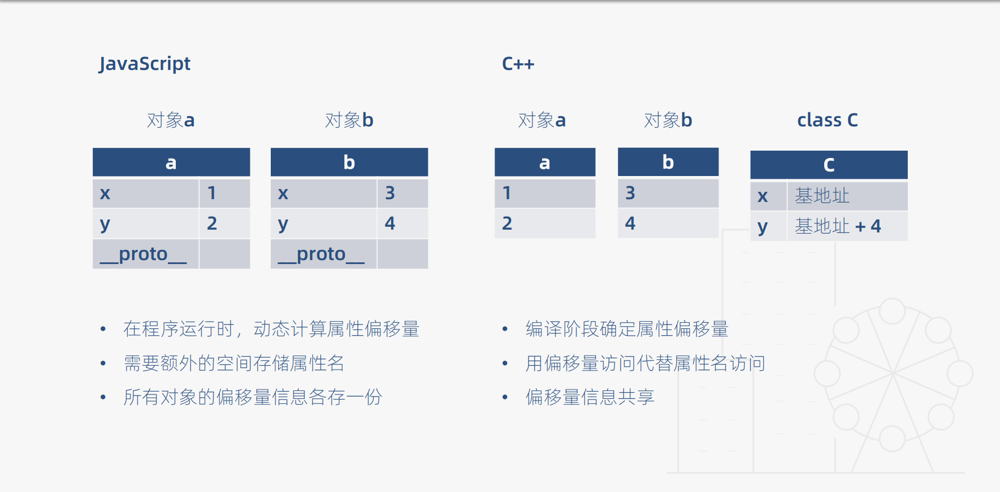
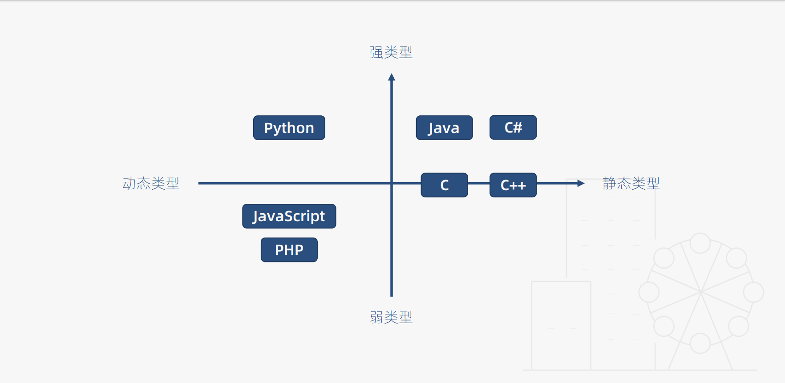

# 静态类型语言
在编译阶段确定所有变量的类型

# 动态类型语言
在执行阶段确定所有变量的类型

```javascript
【JavaScript】
class JS {
  constructor(x, y) {
    this .x = x;
    this.y = y;
  }
}

function add(a, b) {
  return a.x + a.y + b.x + b.y;
}
```

```C++
【C++】
class C {
  public:
    int x;
    int y;
}
int add(C a, C b) {
  return a.x + a.y + b.x + b.y;
}
```

# JS与C++的对比


# 静态类型与动态类型对比


# 四象限区分各语言的类型



