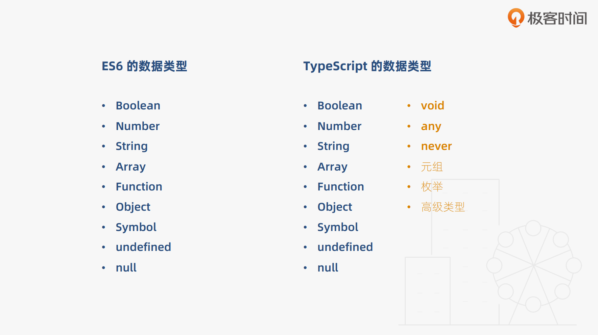

# 基本类型

## JS与TS基本类型对比



## 类型注解语法
作用: 相当于强类型语言中的类型声明
语法:  (变量/函数): type
例子：
``` typescript
let a: string = 'I am string';
```

## 编写示例
基本数据类型demo：
1-基础篇\1.4-code-demo\src\part1.base\05.datatype.ts


